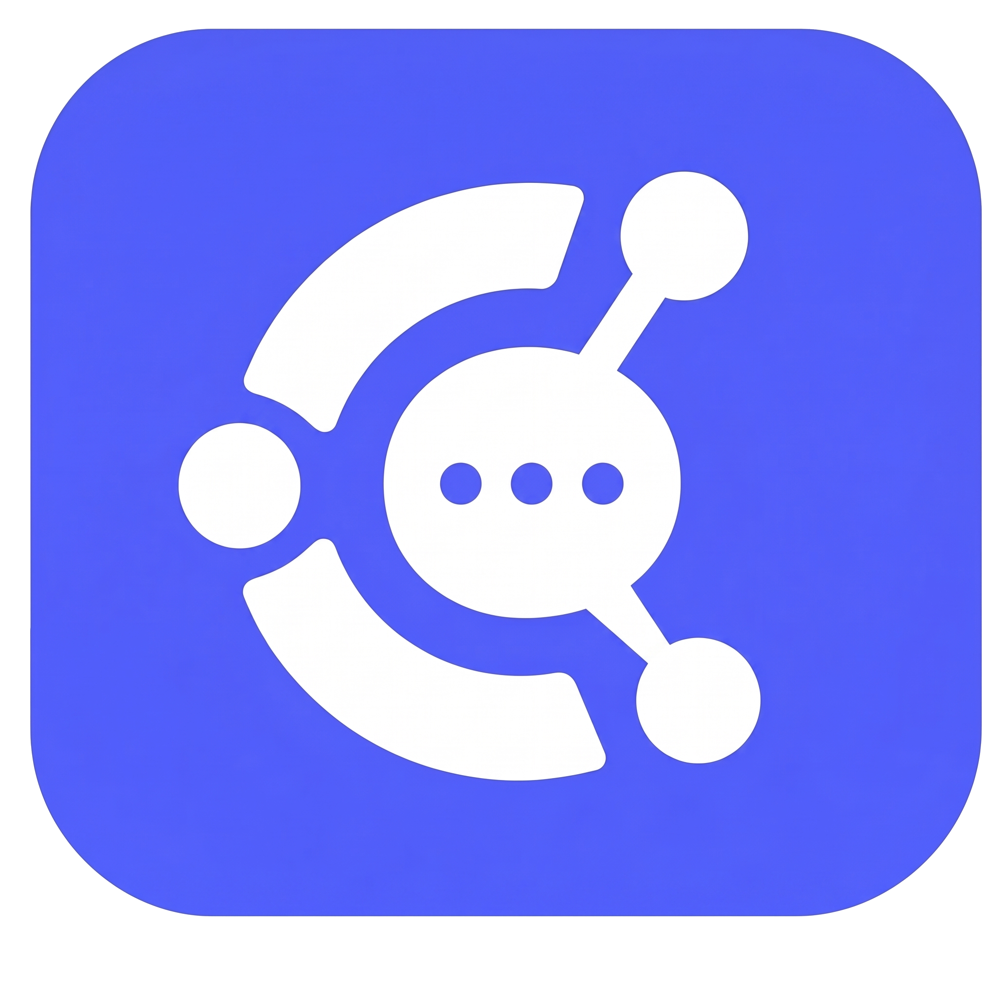
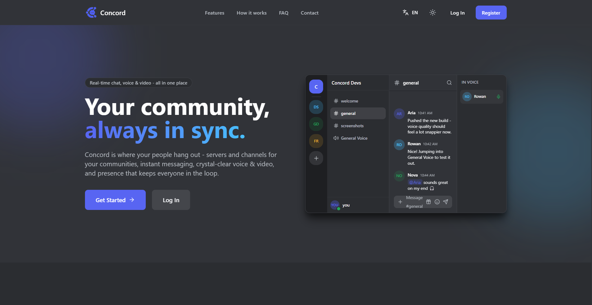
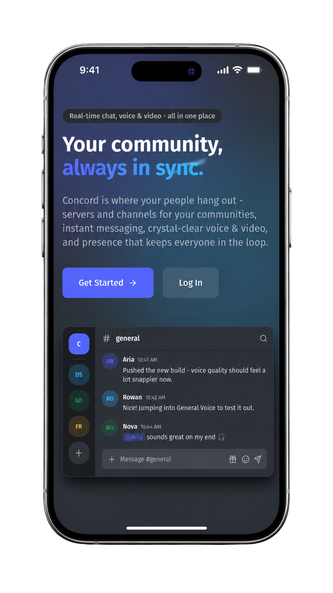

# Concord

<p align="center">
  <br>
  
  <br>
  <br>
  <strong>Concord</strong>
  <br>
  <em>A real-time communication platform for communities.</em>
  <br>
</p>

<p align="center">
  <a href="https://github.com/hhuseyn1/Concord">
      </a>
  <a href="https://github.com/luxpeu1/Concord/actions">
    
  </a>
  <a href="https://github.com/hhuseyn1/Concord">
    
  </a>
  <a href="https://github.com/hhuseyn1/Concord">
    
  </a>
</p>

<p align="center">
  <a href="#about">About</a> •
  <a href="#features">Features</a> •
  <a href="#architecture">Architecture</a> •
  <a href="#getting-started">Getting Started</a> •
  <a href="#deployment">Deployment</a> •
  <a href="#license">License</a>
</p>

---

## About

**Concord** is a full-stack real-time communication platform built around communities, servers, channels and direct conversations.

The project was created as a practical engineering project to explore the challenges behind building a modern real-time application, including real-time messaging, presence, voice and video communication, permissions, search, notifications and cloud deployment.

Concord has both a web client and a Flutter mobile client sharing the same backend.

---

## Preview

### Web Application

<p align="center">
  
</p>

### Mobile Application

<p align="center">
  
</p>


## Features

### Communication

* Real-time messaging
* Direct messages
* Server-based communities
* Text channels
* Voice channels
* Voice and video calls
* Incoming call notifications
* Call history

### Real-Time Experience

* Online/offline presence
* Typing indicators
* Message read receipts
* Real-time notifications
* Real-time call events
* SignalR-based communication

### Social Features

* Friend requests
* User blocking
* Custom user status
* User profiles
* Mentions
* Server invitations

### Search & Discovery

* User search
* Message search
* PostgreSQL full-text/trigram search support
* Server and channel discovery

### Security & Reliability

* JWT-based authentication
* Email verification
* Role-based authorization
* Server and channel permissions
* Request rate limiting
* Input validation
* Protected API endpoints
* Environment-based configuration
* Secrets kept outside source control

### Clients

* Responsive web application
* Flutter mobile application
* Shared backend API
* Mobile-friendly interface

---

# Architecture

Concord follows a **modular monolith architecture**.

Instead of splitting the application into many independently deployed microservices, the backend keeps clear boundaries between application domains while remaining a single deployable backend.

```text
                         ┌──────────────────────┐
                         │      React Web        │
                         │       Client         │
                         └──────────┬───────────┘
                                    │
                              REST / SignalR
                                    │
                         ┌──────────▼───────────┐
                         │    ASP.NET Core       │
                         │        API            │
                         │                       │
                         │  Users                │
                         │  Servers              │
                         │  Channels             │
                         │  Messaging            │
                         │  Notifications        │
                         │  Calls                │
                         └──────┬───────┬────────┘
                                │       │
                         ┌──────▼───┐ ┌─▼────────┐
                         │PostgreSQL│ │  Redis   │
                         └──────────┘ └────┬─────┘
                                           │
                                      SignalR
                                           │
                              ┌────────────▼─────────┐
                              │        Clients       │
                              └──────────────────────┘

                              ┌──────────────┐
                              │   LiveKit    │
                              │              │
                              │ Voice / Video│
                              └──────────────┘
```
---

# Real-Time Architecture

Real-time functionality is one of the core parts of Concord.

**SignalR** is used for application-level real-time events such as:

* New messages
* Typing indicators
* Presence updates
* Read receipts
* Notifications
* Incoming call events

**Redis** provides shared infrastructure for real-time communication when multiple backend instances are involved.

Voice and video communication are handled separately through **LiveKit**, allowing the application backend to focus on authentication, permissions and call state while LiveKit handles the media communication layer.

```text
                     Client
                       │
                       │ SignalR
                       ▼
                ASP.NET Core API
                       │
             ┌─────────┼──────────┐
             │         │          │
             ▼         ▼          ▼
        PostgreSQL   Redis      LiveKit
             │         │          │
             ▼         ▼          ▼
          Storage   Real-time   Voice/Video
                     events
```

---

# Getting Started

## Prerequisites

Make sure you have the following installed:

* [.NET 10 SDK](https://dotnet.microsoft.com/)
* [Node.js](https://nodejs.org/)
* [Flutter](https://flutter.dev/)
* [Docker](https://www.docker.com/)
* Git

Depending on the selected development setup, PostgreSQL and Redis can be started through Docker Compose.

---

## Clone the Repository

```bash
git clone https://github.com/hhuseyn1/Concord.git
cd Concord
```

---

## Backend

Navigate to the backend directory:

```bash
cd backend
```

Configure the required environment variables according to the project's environment configuration.

Then restore dependencies:

```bash
dotnet restore
```

Run the API:

```bash
dotnet run
```

---

## Frontend

Navigate to the frontend:

```bash
cd frontend
```

Install dependencies:

```bash
npm install
```

Start the development server:

```bash
npm run dev
```

---

## Mobile

Navigate to the Flutter application:

```bash
cd mobile
```

Install dependencies:

```bash
flutter pub get
```

Run the application:

```bash
flutter run
```
---

# Deployment

Concord uses a containerized backend and a separately deployed frontend.

```text
                         GitHub
                            │
                            │ GitHub Actions
                            ▼
                    Build / Test / Deploy
                            │
                  ┌─────────┴─────────┐
                  ▼                   ▼
              Azure API             Vercel
                  │                 Frontend
          ┌───────┼────────┐
          ▼       ▼        ▼
      PostgreSQL Redis   LiveKit
```

The frontend is deployed through Vercel, while the backend infrastructure is hosted separately.

The production configuration uses environment-specific secrets and configuration rather than storing credentials in source control.

---

# Contact

**Huseyn Hamidov**

* GitHub: [@hhuseyn1](https://github.com/hhuseyn1)
* Project: [Concord](https://github.com/hhuseyn1/Concord)
* Live Application: [concord-taupe-zeta.vercel.app](https://concord-taupe-zeta.vercel.app)
* Email: [huseynhemi@gmail.com](mailto:huseynhemi@gmail.com)

For questions, feedback or a live demonstration, feel free to reach out.

---

# License

Concord is licensed under the **MIT License**.

See the [LICENSE](./LICENSE) file for the full license text.

Copyright (c) 2026 Huseyn Hamidov
